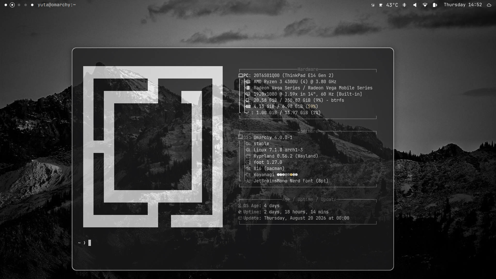

# Dot Minimal Workspaces

Minimalist dot-style workspace indicators for the [Omarchy](https://omarchy.org/) shell bar.



## Install

```bash
omarchy plugin add https://github.com/YutaKoyanagi10/Dot-Minimal-Workspaces.git --enable
```

## Remove

```bash
omarchy plugin remove minimal.dot.workspace
```

## Requirements

- Omarchy Quattro
